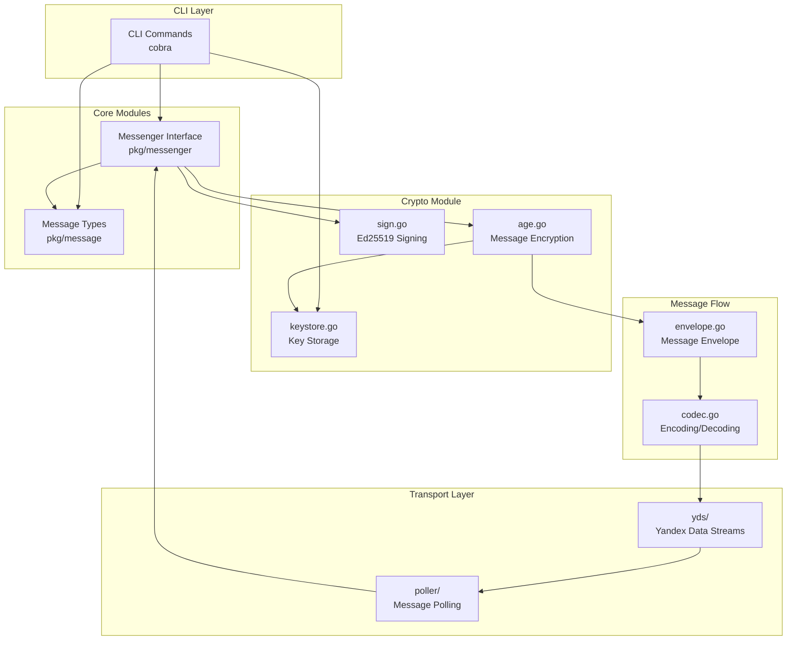

# E2EE Messenger with Yandex Data Streams

## Project Overview

An end-to-end encrypted messenger built with Go that uses Yandex Data Streams (YDS) as the message transport layer. The messenger provides strong encryption guarantees using age for message encryption and ed25519 for digital signatures.

## Architecture



## Module Breakdown

### cmd/messenger/
CLI entry point using cobra framework.
- **main.go**: Application bootstrap
- **root.go**: Root command with global flags
- **send.go**: Send message command
- **receive.go**: Receive messages command
- **keygen.go**: Key generation command
- **init.go**: Initialize user/stream command

### internal/crypto/
Cryptographic operations module.
- **age.go**: Age encryption/decryption for message content
- **sign.go**: Ed25519 signing and verification
- **keystore.go**: AES-256-GCM encrypted key storage

### internal/message/
Message handling module.
- **envelope.go**: Message envelope with headers, signatures
- **codec.go**: Message encoding/decoding (JSON, binary)

### internal/yds/
Yandex Data Streams integration.
- **client.go**: Kinesis client wrapper for YDS
- **config.go**: YDS configuration
- **retry.go**: Retry logic with exponential backoff

### internal/poller/
Message polling loop.
- **loop.go**: Polling loop with cursor management

### pkg/messenger/
Messenger interface definitions.
- **interface.go**: Messenger service interface

### pkg/message/
Message type definitions.
- **types.go**: Core message types

### test/mock_yds/
Mock YDS server for testing.
- Mock implementation of Kinesis/YDS API

### test/fixtures/
Test fixtures and test data.

### config/
Configuration files.
- **default.yaml**: Default configuration

### scripts/
Shell scripts for setup and operation.
- **init_stream.sh**: Initialize YDS stream
- **get_iam_token.sh**: Get IAM token (deprecated - using API key)

## Security Design

### Key Hierarchy
```
User Master Key (derived from password)
├── age Encryption Key (X25519 → age format)
└── ed25519 Signing Key (separate)
```

### Storage Format
Keys stored in AES-256-GCM encrypted JSON:
```json
{
  "version": 1,
  "salt": "<base64>",
  "nonce": "<base64>",
  "ciphertext": "<base64>"
}
```

### Authentication
- Primary: API Key (Yandex Cloud API key)
- Alternative: IAM Token (deprecated)

## Implementation Sequence

1. **Phase 1: Crypto Module**
   - Implement keystore.go (key storage)
   - Implement sign.go (ed25519)
   - Implement age.go (encryption)

2. **Phase 2: Message Types**
   - Implement types.go
   - Implement envelope.go
   - Implement codec.go

3. **Phase 3: YDS Transport**
   - Implement config.go
   - Implement retry.go
   - Implement client.go
   - Implement loop.go

4. **Phase 4: CLI**
   - Implement root.go
   - Implement keygen.go
   - Implement init.go
   - Implement send.go
   - Implement receive.go

5. **Phase 5: Testing & Polish**
   - Mock YDS server
   - Unit tests
   - Documentation

## Dependencies

| Package | Purpose |
|---------|---------|
| filippo.io/age | Message encryption |
| github.com/aws/aws-sdk-go-v2/service/kinesis | YDS client |
| github.com/spf13/cobra | CLI framework |
| github.com/spf13/viper | Configuration |
| golang.org/x/crypto/ed25519 | Digital signatures |
| golang.org/x/crypto/chacha20poly1305 | Symmetric encryption |
| golang.org/x/crypto/argon2 | Key derivation |

## Configuration

Configuration via YAML or environment variables:

```yaml
yds:
  endpoint: "endpoint.yaml.rus.cloud-apps.store"
  stream: "messenger-stream"
  region: "ru-central1"
  api_key: "${YDS_API_KEY}"

storage:
  path: "~/.nit/keys"
  encryption: "argon2id"

polling:
  interval: 1s
  batch_size: 10
```

## Running

```bash
# Initialize keys
nit keygen

# Initialize stream
nit init

# Send message
nit send alice "Hello, World!"

# Receive messages
nit receive
```
